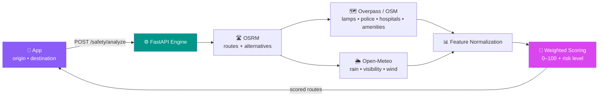

<!-- ══════════════════════════ HERO ══════════════════════════ -->
<div align="center">

<a href="#">
  
</a>

<br/>

<a href="#">
  
</a>

<br/><br/>

<!-- ══════════════ BADGES ══════════════ -->
<p>
  
  
  
  
</p>

<p>
  
  
  
  
</p>

<br/>

<!-- ══════════════ QUICK NAV ══════════════ -->
<a href="#-why-safe-her"><b>Why</b></a> &nbsp;•&nbsp;
<a href="#-features"><b>Features</b></a> &nbsp;•&nbsp;
<a href="#-how-it-works"><b>How it works</b></a> &nbsp;•&nbsp;
<a href="#-quick-start"><b>Quick start</b></a> &nbsp;•&nbsp;
<a href="#-architecture"><b>Architecture</b></a> &nbsp;•&nbsp;
<a href="#-privacy"><b>Privacy</b></a>

</div>

<br/>

<div align="center">
  
</div>

<!-- ══════════════════════════ WHY ══════════════════════════ -->

## 💜 Why Safe-Her

> **Safety shouldn't depend on luck.** It should depend on information you can trust, and help you can reach in one tap.

Safe-Her turns the open world into a live safety layer. Before you walk, ride, or drive, it reads the street around you — **how well-lit it is, how close help is, what the weather and hour add to the risk** — and gives you an honest score. And if something goes wrong, a single button quietly brings your trusted people to your side with your live location.

No dark patterns. No selling your movements. Just a companion that stays with you until you're home.

<br/>

<div align="center">

| 🛡️ **Trusted by design** | ⚡ **Fast when it counts** | 🌍 **Open data, no black box** |
|:---:|:---:|:---:|
| Location shared *only* during an active SOS | 3-second armed countdown, then instant broadcast | Scores built on OpenStreetMap, OSRM & live weather |

</div>

<br/>

<div align="center">
  
</div>

<!-- ══════════════════════════ FEATURES ══════════════════════════ -->

## ✨ Features

<table>
<tr>
<td width="50%" valign="top">

### 🚨 Smart Emergency SOS
A guarded, panic-proof flow — confirm → **3-second countdown** → activate. On trigger it captures your GPS, starts **background location tracking**, and lets you fire an alert to every saved contact over SMS or the native share sheet.

</td>
<td width="50%" valign="top">

### 🗺️ AI Route Safety
Enter a destination and Safe-Her scores **every route option** OSRM returns. Each is graded segment-by-segment so you can choose the *safest* path, not just the fastest — with distance, ETA and a live risk badge.

</td>
</tr>
<tr>
<td width="50%" valign="top">

### 💡 Live Safety Index
The home screen reads your current spot in real time — **street-lamp density, nearby police & hospitals, open amenities, weather and time-of-day** — and shows a single, honest 0–100 score with a plain-language label.

</td>
<td width="50%" valign="top">

### 📍 Live Journey Monitoring
Start a journey and watch progress fill in real time — GPS accuracy, distance remaining, and safety re-assessment milestones, with one-tap SOS and helpline dialing always within reach.

</td>
</tr>
<tr>
<td width="50%" valign="top">

### 🧭 Community Hazard Reports
Tag poor lighting, harassment, theft, broken CCTV or unsafe stops — attach a photo, submit **anonymously**. Every report sharpens the map for the next person walking through.

</td>
<td width="50%" valign="top">

### 🌗 Blossom Luxe & Midnight Shield
Two hand-tuned themes: a warm violet daylight palette and an obsidian, high-contrast night mode for **stealth and readability** when you need it most. Your choice persists across sessions.

</td>
</tr>
</table>

<br/>

<div align="center">
  
</div>

<!-- ══════════════════════════ HOW IT WORKS ══════════════════════════ -->

## 🧠 How It Works

Safe-Her's **Safety Engine** doesn't guess. Every score is assembled from live, verifiable open data through a transparent pipeline:



<details>
<summary><b>🔎 How a safety score is weighted</b></summary>

<br/>

Each route segment is scored 0–100 from eight normalized factors, then length-weighted into a final route score:

| Factor | Weight | Signal |
|:--|:--:|:--|
| 💡 Lighting | **20%** | Street-lamp density per km (OSM `highway=street_lamp`) |
| 🛣️ Road type | 15% | Classified highway type of the segment |
| 👮 Police proximity | 15% | Stations within ~1 km |
| 🏥 Medical | 10% | Hospitals & clinics nearby |
| 🏪 Amenities | 10% | Open shops, pharmacies, transit, restaurants |
| 🌦️ Weather | 10% | Rain, visibility, wind |
| 🕒 Time of day | 10% | Hour + weekday risk curve |
| 🔀 Route shape | 10% | Turns per km (fewer = clearer) |

> A **confidence** value travels with every score, and drops honestly when data is sparse — so the app never overstates what it knows.

</details>

<br/>

<div align="center">
  
</div>

<!-- ══════════════════════════ QUICK START ══════════════════════════ -->

## 🚀 Quick Start

> **Prerequisites** — Node 18+, npm, Python 3.10+, and the Expo tooling. Two terminals: one for the app, one for the engine.

### 1 — The Safety Engine (FastAPI)

```bash
cd safety-engine
python -m venv .venv && source .venv/bin/activate   # Windows: .venv\Scripts\activate
pip install -r requirements.txt
uvicorn main:app --reload --port 8000
```

> Engine live at `http://localhost:8000` · health check at `/health` · interactive docs at `/docs`

### 2 — The App (Expo)

```bash
npm install
npm run dev            # starts the Expo dev server
```

Then press **`w`** for web, or scan the QR code with **Expo Go** on your phone.

<details>
<summary><b>⚙️ Configuration notes</b></summary>

<br/>

- Copy `.env.example` → `.env` and fill in any public tokens.
- The app calls the engine at `http://localhost:8000`. On a **physical device**, point it at your machine's LAN IP (e.g. `http://192.168.x.x:8000`) so the phone can reach the engine.
- Available scripts: `npm run dev` · `npm run build:web` · `npm run lint` · `npm run typecheck`.

</details>

<br/>

<div align="center">
  
</div>

<!-- ══════════════════════════ ARCHITECTURE ══════════════════════════ -->

## 🏗️ Architecture

```
safe-her/
├── app/                      # 📱 Expo Router screens (file-based routing)
│   ├── (tabs)/
│   │   ├── index.jsx         # Home · Live Safety Index · SOS
│   │   ├── routes.jsx        # AI route finder & scored alternatives
│   │   ├── journey.jsx       # Live journey monitoring
│   │   ├── report.jsx        # Community hazard reporting
│   │   └── profile.jsx       # Profile, photo & app settings
│   ├── auth.jsx              # Citizen / Government sign-in
│   ├── emergency-contacts.jsx
│   └── _layout.jsx           # Root layout · Theme + SOS + Auth providers
│
├── components/               # 🧩 Theme-aware UI kit, maps, SOS & score views
├── lib/                      # 🧠 Core logic
│   ├── sos.js                #    SOS state machine (Context)
│   ├── safetyApi.js          #    Engine client + graceful fallbacks
│   ├── emergencyContacts.js  #    Contact CRUD + validation
│   ├── alertSharing.js       #    SMS / share-sheet dispatch
│   └── location.js           #    GPS, geocoding, distance math
│
└── safety-engine/            # ⚙️ FastAPI safety microservice
    ├── main.py               #    App + CORS + routers
    ├── routes/               #    /safety/analyze · /safety/spot
    ├── services/             #    OSRM · Overpass · Weather · Features
    └── engine/               #    Rule-based scoring (ML-ready hook)
```

<div align="center">

**Frontend** `React Native · Expo Router · Lucide · Reanimated · Leaflet (web)`
&nbsp;•&nbsp;
**Engine** `FastAPI · httpx · Pydantic`
&nbsp;•&nbsp;
**Data** `OpenStreetMap · OSRM · Open-Meteo`

</div>

<br/>

<div align="center">
  
</div>

<!-- ══════════════════════════ PRIVACY ══════════════════════════ -->

## 🔒 Privacy

Trust is the product. These are commitments, not footnotes:

- **🛰️ Location on a need-to-know basis** — your live coordinates leave the device *only* while an SOS session is active.
- **🕵️ Anonymous reports** — community hazard submissions carry no personal identifiers.
- **📵 No tracking, no ad tech** — Safe-Her exists to protect you, not to profile you.
- **🔍 Auditable scoring** — every safety number is built from open, inspectable data sources.

<br/>

<div align="center">
  
</div>

<!-- ══════════════════════════ ROADMAP ══════════════════════════ -->

## 🗺️ Roadmap

- [x] Rule-based safety scoring engine
- [x] Guarded SOS flow with background tracking
- [x] Emergency contacts + SMS / share alerts
- [x] Community hazard reporting
- [ ] Native maps (iOS / Android) parity with web
- [ ] ML-based scoring model *(engine hook already in place)*
- [ ] Offline map caching for low-connectivity transit
- [ ] Wearable / panic-button SOS triggers
- [ ] Live police dispatch integration

<br/>

<div align="center">

<!-- ══════════════════════════ FOOTER ══════════════════════════ -->

### 💜 Built to walk with you, all the way home.

<sub>Contributions welcome — open an issue or a PR. Please treat safety-critical changes with the care they deserve.</sub>

<br/><br/>


</div>
